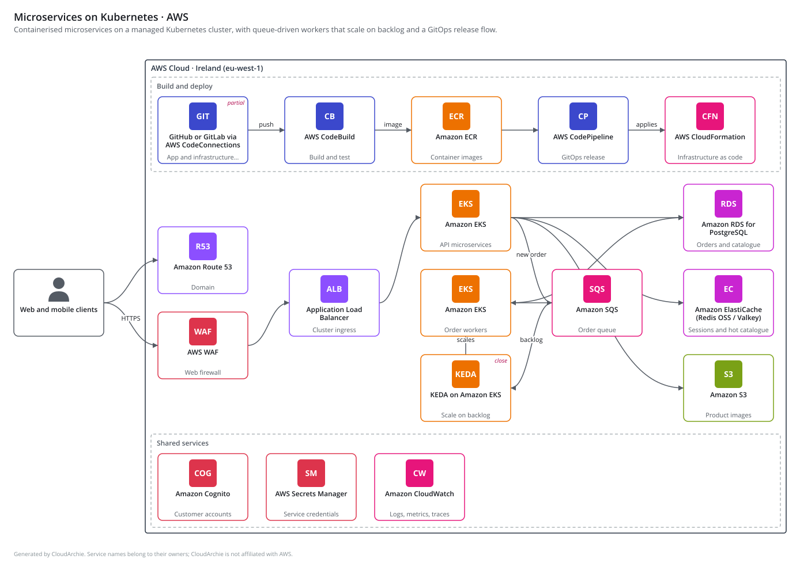

# Clarchy

**Describe your app. Get the architecture.** Type your requirements or upload a Word, PDF
or Excel document. An agent turns them into a cloud-neutral spec and designs everything
the app needs, from source control, builds and container images to compute, autoscaling,
databases, storage and monitoring. It then shows the design on **AWS, Azure, Google Cloud
or open source**, each in its own look, explains every choice and estimates the **cost for
1 month, 6 months, 1 year and 3 years**, on demand and with commitments.

**Live site:** https://clarchy.com plans your own requirements
right in your browser, with no server: the page runs Clarchy's Python engine with
[Pyodide](https://pyodide.org). Planning is rule-based by default; for the AI agent, use an
open-source model on Hugging Face with your own free token, or a model on your machine
through Ollama. AWS prices for every region Clarchy offers are refreshed from the AWS
Price List API every day.

The site looks like an architect's drawing set: trace paper by day, a drafting table at
night, redline orange for what matters, sheet numbers, title blocks and dimension lines. A
protractor turns as you scroll the home page and a detail drawing assembles stage by stage
([ADR 0009](docs/decisions/0009-a-drawing-set-identity.md)).



## What you get

| Page | What it does |
|---|---|
| **Plan** | Type or drop in a requirements document (.docx, .pdf, .xlsx, .md, .txt), or start from a realistic sample (a field service agent for wind turbine technicians, a claims triage agent, clinic booking under HIPAA, fleet telemetry, supplier invoice processing). Watch the pipeline work stage by stage, then explore the result: a diagram per provider, every service grouped by lifecycle stage, the cost over time, the AI and data policies that apply, step-by-step workflows that light up the diagram, and the editable YAML spec. Answer the open questions and plan again. |
| **Examples** | Seven reference architectures (serverless web app, containerised API, event-driven processing, data pipeline, RAG chatbot, microservices on Kubernetes, AI agent platform) on every provider. |
| **Services** | A catalog of every capability with the equivalent service on each provider side by side. Filter by lifecycle stage, provider and how close the match is, or search by any service name ("KEDA", "LangGraph", "Glacier", "Copilot"). |
| **How to** | A step-by-step guide: what to put in a brief and what each fact changes, reading the drawing and its tabs, answering questions, downloading, and using an AI model. Its example brief plans in one click. |
| **Blog** and **About** | Why Clarchy exists, worked examples and AI regulations for architects; and what Clarchy stands for, with a contact address. |

Every component carries a **rationale**, the **sentences from your document** that led to
it, how close each provider's service is (**exact, close or partial**) and the
**alternatives**. What the planner had to assume, and what you should confirm, is listed
at the top.

Diagrams follow each provider's visual language (AWS dark frame and category colours,
Azure blue, Google Cloud's palette, a neutral style for open source). AWS and Azure
diagrams use their providers' official architecture icons; the others use lettered badges
(see [Official provider icons](#official-provider-icons)).

## How the agent works

```
document ─► read ─► understand ─► design ─────────► toolchain ─► workflows ─► map
 .docx       text    requirements   Claude + MCP      CI/CD,       request,     AWS, Azure,
 .pdf                needs, gaps    tools, validated  registry,    background,  Google Cloud,
 .xlsx                              loop              KEDA         delivery     open source
```

1. **Read**: Word, Excel and PDF files are parsed locally (zip and XML for Office files,
   [pypdf](https://pypi.org/project/pypdf/) for PDFs), with size and zip-bomb limits.
2. **Understand**: Claude extracts users, peak load, data size, availability, region,
   compliance and budget as **structured output** (a JSON schema), plus each need with a
   quote from the document. Quotes that are not in the document are dropped.
3. **Design**: Claude works as an **agent**. It is an MCP client of Clarchy's own
   **MCP server**, so it can list capabilities, regions and reference patterns, search
   equivalent services and validate drafts. It must finish by calling `submit_design`,
   whose input is checked against the schema and every provider mapping. Errors go back
   to the model to fix. Evidence quotes that cannot be found in the document are removed.
4. **Toolchain**: deterministic code adds source control, CI build, container registry
   (for containers), release pipeline and infrastructure as code, plus **KEDA**
   event-driven autoscaling when Kubernetes workers consume a queue or stream.
5. **Workflows**: Claude describes how a request is served, how background or data work
   flows and how a change is shipped. Each step is limited to the real component ids.
6. **Map**: every capability becomes a concrete service on each provider.

The agent runs on **Claude** (Claude API or Amazon Bedrock) or on an **open-source model**
through any OpenAI-compatible endpoint: Hugging Face Inference Providers, Ollama, vLLM or
LM Studio. Requests and replies are translated, so the same loop and guardrails apply.

Without a model the same pipeline runs with a **rule-based planner** that reads the text
with patterns, so the app always works offline. If the AI path fails part-way, the run
falls back to the rule-based draft and says so.

The model never draws the diagram or invents services. Layout is deterministic code, and
the model can only use capabilities from the catalog (see
[ADR 0004](docs/decisions/0004-agent-designs-with-mcp-tools.md)).

## Security, records and AI policies

Designs include what reviews ask about, not just the app:

- **AI building blocks**: agent orchestration (LangGraph, Bedrock AgentCore, Foundry Agent
  Service, Vertex AI Agent Engine), an LLM gateway (LiteLLM, Azure API Management),
  guardrails (Bedrock Guardrails, Azure AI Content Safety, Model Armor, NeMo Guardrails)
  and LLM tracing (Langfuse, CloudWatch, Application Insights, Cloud Trace).
- **Security and access**: access governance (who may change the cloud, approved by the
  cloud architects), customer-managed keys and an audit trail.
- **Records**: backups, and an archive tier (S3 Glacier Deep Archive, Azure Archive,
  Cloud Storage Archive) for records kept for years; the planner reads retention periods
  such as "audit logs are kept for 7 years".
- **Developer tools** in the build lane: cloud dev environments (GitHub Codespaces, Cloud
  Workstations, Coder) and AI coding assistants (Amazon Q Developer, GitHub Copilot, Gemini
  Code Assist), priced per developer. Cloudflare and the OpenAI, Anthropic and Hugging Face
  APIs appear as alternatives.

The **Policies** view checks each design against the EU AI Act, GDPR, the OWASP Top 10
for LLM applications, the NIST AI RMF, ISO/IEC 42001, model provider terms, HIPAA,
PCI DSS, SOX, ISO/IEC 27001 and India's DPDP Act, as they apply
([data/policies.yaml](src/clarchy/data/policies.yaml)). Each obligation is covered by a
component, a gap with a suggested capability, or an action for the team. It is a design
checklist, not legal advice.

## Cost estimates

Every design is priced on each cloud, per service and per line item (quantity × unit
price), for **1 month, 6 months, 1 year and 3 years**, on demand and with **1- or 3-year
commitments** (Savings Plans, reserved instances, committed use discounts), with the month
when a 1-year commitment pays off. Storage grows with the stated data growth, so longer
periods cost more than a multiple of the first month.

- **AWS prices come from the [AWS Price List API](https://docs.aws.amazon.com/awsaccountbilling/latest/aboutv2/price-changes.html)**,
  AWS's official machine-readable source behind its pricing pages, with the SKU and AWS's
  description for every price, including Savings Plans and reserved-instance rates, in
  each of the eight AWS regions Clarchy offers; a design is priced in its own region.
  The `Prices` workflow refreshes them every day and commits them when a price changes
  ([ADR 0014](docs/decisions/0014-daily-prices-for-every-region.md)).
  `clarchy prices update` refreshes them on your machine, and
  `clarchy prices lookup AmazonS3 storage` searches any service's current prices live.
- **Azure prices come from the Azure Retail Prices API**, for the same eight regions,
  refreshed daily: each price names its meter. The few the API doesn't carry (Entra ID
  P2, Azure DevOps parallel jobs, Front Door WAF rules) stay hand-compiled and are tagged
  approximate line by line.
- Google Cloud prices are compiled by hand from its pricing pages and marked
  **approximate** until a `GCP_API_KEY` secret lets the daily job read the Cloud Billing
  Catalog API.
  Services from outside the three clouds, such as GitHub Codespaces and Copilot, come from
  a third-party price book and are tagged approximate line by line.
- Usage comes from each component's `sizing` and the requirements, and every line says
  what it assumed. Edit the spec to see the effect. See
  [ADR 0007](docs/decisions/0007-cost-estimates-from-price-lists.md).

## Run it yourself

```bash
git clone https://github.com/namratabhatia21/Clarchy && cd Clarchy
python -m venv .venv && . .venv/bin/activate
pip install -e ".[all]"

clarchy serve                       # http://127.0.0.1:8000, rule-based planner
```

### Turn on the AI agent

```bash
export ANTHROPIC_API_KEY=sk-ant-...     # Claude API
clarchy serve                        # the top bar now shows the AI agent

# or Claude on Amazon Bedrock, with your usual AWS credentials
export CLARCHY_LLM=bedrock AWS_REGION=us-east-1

# or an open-source model on Hugging Face (free token: huggingface.co/settings/tokens)
export HF_TOKEN=hf_...                   # default model: Qwen/Qwen2.5-72B-Instruct

# or an open-source model on your own machine
ollama pull qwen2.5:7b
export CLARCHY_LLM=ollama CLARCHY_MODEL=qwen2.5:7b
```

| Variable | Meaning |
|---|---|
| `ANTHROPIC_API_KEY` | Enables the AI agent through the Claude API. |
| `HF_TOKEN` | Enables the AI agent on open-source models through Hugging Face Inference Providers. |
| `CLARCHY_LLM` | `anthropic`, `bedrock`, `huggingface`, `ollama`, `openai-compatible` or `rules` (default: `anthropic` with an Anthropic key, `huggingface` with `HF_TOKEN`, otherwise `rules`). |
| `CLARCHY_MODEL` | The model id (defaults are in `src/clarchy/planner/`). |
| `CLARCHY_LLM_BASE_URL`, `CLARCHY_LLM_API_KEY` | Endpoint and key for `ollama` (optional) or `openai-compatible`. |
| `AWS_REGION` | Region for Amazon Bedrock. |
| `CLARCHY_PRICES_DIR` | Folder of refreshed price books (default: `~/.cache/clarchy/prices`, written by `clarchy prices update`). |
| `CLARCHY_CORS_ORIGINS` | Comma-separated origins allowed to call the API, for a front end hosted elsewhere. |
| `CLARCHY_ICONS_AWS` (and `_AZURE`, `_GCP`) | Folder of a provider's official icon package; see below. |

### From the command line

```bash
clarchy plan requirements.docx              # AI agent if configured, otherwise rules
clarchy plan "A booking app for 40 clinics in the UK..." --rules -o plan/
clarchy plan brief.pdf --region eu-central --mcp "<command that starts an MCP server>"
```

`plan` writes `spec.yaml` plus a diagram (`.svg`) and an explanation (`.md`) for every
provider. `--mcp` attaches extra MCP servers (a pricing or documentation server, say)
whose tools the agent may also use.

Other commands: `patterns`, `validate <spec>`, `render <spec> --provider azure`,
`explain <spec>`, `prices update`, `prices lookup <AWS service> <words>`, `export-site`,
`mcp`. Run `clarchy --help` for details.

## Use Clarchy from Claude

Clarchy is an MCP server, so Claude Code, Claude Desktop or any MCP client can design
with it directly:

```bash
claude mcp add clarchy -- clarchy mcp                     # Claude Code
```

```json
{ "mcpServers": { "clarchy": { "command": "clarchy", "args": ["mcp"] } } }
```

(Claude Desktop: add that to `claude_desktop_config.json`, using the full path to
`clarchy` inside your virtual environment.)

| Tool | What it does |
|---|---|
| `list_capabilities`, `list_regions`, `list_patterns`, `get_pattern` | The vocabulary and the reference designs. |
| `search_services` | Equivalent services across providers for a capability or service name. |
| `validate_spec` | Errors to fix and warnings worth considering, against every provider. |
| `add_delivery_toolchain` | Adds CI/CD, registry, infrastructure as code and KEDA where needed. |
| `render_design` | SVG diagram and Markdown explanation on one provider. |
| `estimate_cost` | Monthly cost and 1-month to 3-year totals, on demand and with commitments. |
| `aws_price_lookup` | Search the latest AWS prices of one service, live from the AWS Price List API. |
| `draft_architecture` | A rule-based first draft from requirements text. |

The server also offers each pattern as a resource (`clarchy://patterns/{id}`) and a
`design_architecture` prompt. For Claude Code there is an Agent Skill in
[skills/clarchy-architect](skills/clarchy-architect/SKILL.md) that walks through a
complete design; copy the folder to `~/.claude/skills/`.

## The spec

Designs are YAML built from **capabilities** (`object-storage`, `kubernetes`,
`message-queue`, ...) rather than product names, so one design maps to every provider:

```yaml
name: Photo sharing
summary: Upload photos, generate thumbnails, share albums.
requirements: {users: 50000, peak_rps: 40, region: india-mumbai}
components:
  - {id: users, capability: client}
  - {id: api, capability: api-gateway}
  - id: thumbs
    capability: serverless-function
    rationale: Thumbnails are short bursty jobs; pay only when photos arrive.
    evidence: ["Thumbnails should be ready within a few seconds"]
    sizing: {invocations_per_month: 2000000, avg_duration_ms: 400, memory_mb: 1024}
  - {id: photos, capability: object-storage, sizing: {storage_gb: 800}}
edges:
  - {from: users, to: api}
  - {from: api, to: thumbs}
  - {from: thumbs, to: photos}
```

Optional sections: `assumptions`, `open_questions` and `workflows` (named, ordered steps
that reference component ids). Capabilities, with their tier, lifecycle stage and
category, are in
[`data/capabilities.yaml`](src/clarchy/data/capabilities.yaml); each provider's
services and diagram theme are in [`data/mappings/`](src/clarchy/data/mappings/).

## Code map

| Module | Role |
|---|---|
| `ingest.py` | Word, Excel, PDF and text to plain text, with limits |
| `planner/` | `pipeline.py` (stages and events), `agent.py` (understand, design loop, workflows), `toolbox.py` (MCP client) and `local_toolbox.py` (the same tools in-process), `rules.py` (offline planner), `llm.py` (Claude API or Bedrock), `openai_compat.py` (open-source models), `prompts.py` |
| `massing.py` | A design as an architect's massing model, block height by monthly cost; the home page's hero |
| `pricing.py`, `aws_prices.py`, `data/prices/` | Usage model, price books and billing models; AWS prices from the Price List API |
| `browser.py` | Entry points for the in-browser engine (Pyodide) |
| `tools.py`, `mcp_server.py` | The tool functions and the MCP server that exposes them |
| `delivery.py`, `workflows.py` | Deterministic build-and-deploy toolchain and generated workflows |
| `spec.py`, `catalog.py`, `mapping.py` | The neutral spec, its data and the provider mapping |
| `render.py`, `render_doc.py`, `explain.py` | SVG diagrams, drawn the way AWS, Azure and Google Cloud documentation draws them ([ADR 0016](docs/decisions/0016-diagrams-in-each-providers-own-style.md)), and Markdown explanations |
| `web.py`, `payloads.py`, `static/` | FastAPI app (with a server-sent events `/api/plan` stream) and a no-build front end |
| `planner/answers.py` | Answers to open questions turned into requirement statements for a re-plan |
| `policies.py`, `data/policies.yaml` | AI and data regulations checked against a design |
| `blog.py`, `data/blog/` | Blog posts in Markdown, rendered without dependencies |
| `site.py`, `static/index.html` | Every page at its own address, rendered from one template with its title, description, breadcrumbs and structured data |
| `export.py` | The static site (pages, sitemap, robots.txt, Cloudflare `_headers` and `_redirects`) with the in-browser engine bundle |

Design decisions are recorded in [docs/decisions/](docs/decisions/).
The site's look and the patterns it never uses are in [docs/VISUAL-DESIGN.md](docs/VISUAL-DESIGN.md); read it
before changing anything people see.

## Static site

```bash
clarchy export-site -o site/                          # the whole site (see below)
clarchy export-site -o site/ --no-engine              # replay-only site
clarchy export-site -o site/ --api-base https://...   # a front end for a hosted API
clarchy export-site -o site/ --fragment               # one file with every page, #hash links
```

Every page has its own address: `/`, `/examples/` and `/examples/<id>/`, `/services/`,
`/how-to/`, `/blog/`, `/about/`, `/privacy/` and `/terms/`
([ADR 0013](docs/decisions/0013-a-page-per-address.md)). Each is a complete HTML file with
its content, title, description, canonical link, breadcrumbs and structured data, so search
engines read it without running scripts; once a page has loaded, the menu switches pages
without reloading. Beside the pages go `sitemap.xml`, `robots.txt`, Cloudflare's
`_headers` (long caching for `assets/`, and `noindex` on the workers.dev copy) and
`_redirects` (an address without its final slash moves to the one with it, in one 301).
Links are root-relative, so serve the folder at the root of a domain.

The pages plan in the visitor's browser: they load Pyodide from its CDN on first use (about
15 MB, then cached) and run this package from `clarchy-engine.zip`. The scripts, the
catalog and recorded runs of the samples are in `assets/` with a content hash in their
names; the pre-drawn examples sit in `designs/` and load when shown
([ADR 0008](docs/decisions/0008-plans-run-in-the-browser.md)). The folder also holds the
fonts (`fonts/`, served with the site under the SIL Open Font License), the sharing
image (`og.png`), the icons and `404.html`, so serve it over HTTP rather than opening a
file from disk. With `--api-base` the pages talk to a Clarchy server instead, which needs
`CLARCHY_CORS_ORIGINS` set. `clarchy serve` serves the same pages itself.

The live site is **clarchy.com**, on the Cloudflare Worker described below. After a change
of addresses, submit `https://clarchy.com/sitemap.xml` in Google Search Console and Bing
Webmaster Tools (both free).

**Hosting on Cloudflare.** A Cloudflare Worker named `clarchy` serves the built files as
static assets (`wrangler.jsonc`). `make prices site` builds the files into `site/`. Two
things deploy it:

- **Workers Builds, on every push.** Connect the Worker to this repository
  (Worker → Settings → Build). Set the build command to `make prices site`, keep the
  deploy command `npx wrangler deploy`, and pick the branch the site is built from.
- **The `Pages` workflow, when run by hand**, as a fallback. It needs an API token with
  the *Workers Scripts: Edit* permission, saved as the repository secrets
  `CLOUDFLARE_API_TOKEN` and `CLOUDFLARE_ACCOUNT_ID`. Without those secrets it skips the
  Cloudflare step.

The `Prices` workflow refreshes the price books every morning and commits them when a
price has changed (as github-actions[bot]); Workers Builds deploys that commit like any
other. `make prices` refreshes them only when `CLARCHY_REFRESH_PRICES=1`, so builds use the
committed books and stay quick.

The site is then live at `clarchy.<your-subdomain>.workers.dev`. To move clarchy.com:

1. In the Worker's Settings → Domains & Routes, add the custom domains `clarchy.com` and
   `www.clarchy.com` (the domain must be on Cloudflare DNS; remove old records that
   point to GitHub).
2. Remove the custom domain from GitHub's Settings → Pages and set the repository variable
   `GITHUB_PAGES` to `off`, so only Cloudflare serves the site.

## Official provider icons

Diagrams use the providers' official icons, the
[AWS Architecture Icons](https://aws.amazon.com/architecture/icons/),
[Azure architecture icons](https://learn.microsoft.com/azure/architecture/icons/) and
[Google Cloud icons](https://cloud.google.com/icons), and the open-source view uses each
project's own logo (PostgreSQL, Kafka, vLLM, LiteLLM, Langfuse and others). They ship with
Clarchy for the services it draws, unchanged and under each owner's terms
([ADR 0012](docs/decisions/0012-official-aws-icons-in-aws-diagrams.md), and the
`NOTICE.md` in each folder of `src/clarchy/data/icons/`). A service with no icon gets a
lettered badge coloured by its category. To use a provider's own icon package instead
(or a newer release), download it, read its terms, and point Clarchy at it:

```bash
export CLARCHY_ICONS_AZURE=~/Downloads/Azure_Public_Service_Icons
clarchy icons --provider azure            # shows which icons were found
```

## Development

```bash
make check       # ruff + pytest (the agent is tested with a scripted model, no API key needed)
make examples    # regenerate examples/, which double as golden test files
```

> **Review status:** no provider's mappings have been checked by a specialist yet. The UI
> and the explanations say so. Set `reviewed: true` in
> `src/clarchy/data/mappings/<provider>.yaml` once someone has.

## Roadmap

| Phase | What |
|---|---|
| ✅ 1 | Neutral spec, patterns, AWS/Azure/GCP/OSS mappings, SVG renderer, CLI, web UI and service catalog |
| ✅ 2 | Requirements documents in, agentic planning with MCP tools, build-and-deploy toolchain, workflows, provider-themed results |
| ✅ 3 | Cost estimates for 1 month to 3 years with commitments; AWS from the Price List API; plans in the browser; open-source models |
| 4 | AWS prices for the design's own region, refreshed daily (done); Azure and Google Cloud prices from their price APIs; low/expected/high ranges checked against the official calculators |
| 5 | Spot and data-transfer costs; Well-Architected checks; PDF report |
| 6+ | Open-source cost model including operations effort; specialist review of every mapping |

## Known limitations

- The AI agent has been tested with scripted models (Claude-style and OpenAI-style), not
  against live Claude or Hugging Face here; real-model quality depends on the model and
  the prompts in `planner/prompts.py`. Smaller open models follow tool calls less
  reliably; when they fail, the run falls back to the rule-based draft.
- AWS and Azure prices are for the design's own region. Google Cloud prices are still for
  one reference region (Iowa) and approximate; the cost view says so.
- Scanned PDFs without a text layer cannot be read; paste the text instead.
- Long edges in large diagrams can cross other lines; links to shared services
  (identity, secrets, monitoring) are listed in the explanation rather than drawn.

## Licence

Clarchy is licensed under the [Apache License 2.0](LICENSE). The provider icons, project
logos, fonts and service lists it ships stay under their owners' terms; [NOTICE](NOTICE)
lists them.

AWS, Azure, Google Cloud and all service names are trademarks of their owners.
Clarchy is an independent project, not affiliated with or endorsed by any cloud
provider.
