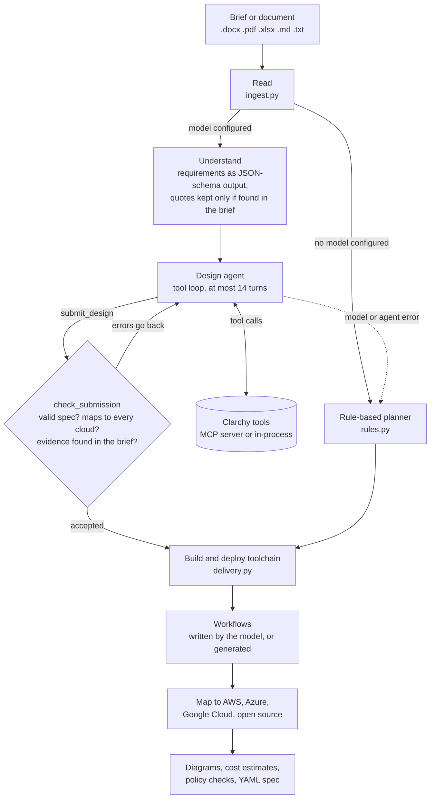

# Clarchy

[](https://github.com/namratabhatia21/Clarchy/actions/workflows/ci.yml)
[](LICENSE)

Clarchy turns a requirements brief into a cloud architecture you can question, price and
compare. Paste a brief or upload a Word, PDF or Excel file. Clarchy reads it, designs the
system, and draws the same design for **AWS, Azure, Google Cloud and open source**. Every
service comes with the sentence from your brief that asked for it, a cost estimate and the
AI and data regulations that apply.

The design step is an **LLM agent with tools**: it works through Clarchy's own MCP server,
and its design is accepted only when a validator passes it. Everything after that
(toolchain, layout, mapping to each cloud, prices) is deterministic code. A rule-based
planner does the same job with no model, so Clarchy always works offline.

**Live demo: [clarchy.com](https://clarchy.com).** It runs in your browser with
[Pyodide](https://pyodide.org). The samples under the brief replay a run of the rule-based
planner recorded when the site was built. A brief you type or upload, or a sample with a
model chosen, is planned live in your browser: by the rule-based planner, or by an
open-source model on Hugging Face or any OpenAI-compatible endpoint, with your own token.
To plan with Claude, or with other MCP servers attached, run Clarchy yourself (below).

Built by [Namrata Bhatia](https://www.linkedin.com/in/namratabhatia21/) as a side project.


## How it works



1. **Read.** Word, Excel and PDF files are parsed locally (zip and XML for Office files,
   [pypdf](https://pypi.org/project/pypdf/) for PDFs), with size and zip-bomb limits.
2. **Understand.** The model extracts users, peak load, data size, availability, region,
   compliance and budget as structured output against a JSON schema, plus each need with
   a quote from the brief. Quotes that are not in the brief are dropped.
3. **Design.** The agent can list capabilities, regions and reference patterns, search
   equivalent services, validate drafts and estimate costs. It finishes only by calling
   `submit_design`, whose spec is checked against the schema and against every
   provider's mapping; errors go back to the model to fix. Evidence that can't be found
   in the brief is removed.
4. **Build and deploy.** Deterministic code adds source control, CI, a container
   registry, a release pipeline and infrastructure as code, plus KEDA autoscaling when
   Kubernetes workers read a queue or stream.
5. **Workflows.** The model describes how a request is served, how background work flows
   and how a change ships, using only real component ids; without a model they are
   generated.
6. **Map.** Each capability becomes a concrete service on each provider, drawn in that
   provider's documentation style and priced.

If the model fails part-way, the run falls back to the rule-based draft and says so. The
model never draws the diagram or invents services: it can only use capabilities from the
catalog ([ADR 0004](docs/decisions/0004-agent-designs-with-mcp-tools.md)).

The agent runs on Claude (the Claude API or Amazon Bedrock) or on any OpenAI-compatible
endpoint (Hugging Face Inference Providers, Ollama, vLLM, LM Studio). Requests and replies
are translated to one format, so the same loop and checks apply to every model
(`planner/openai_compat.py`).

## Quickstart

Python 3.11 or later.

```bash
git clone https://github.com/namratabhatia21/Clarchy && cd Clarchy
python -m venv .venv && . .venv/bin/activate
pip install -e ".[all]"

clarchy serve                         # http://127.0.0.1:8000, rule-based planner
clarchy plan "A booking app for 40 clinics in the UK, about 20,000 patients..." --rules
```

With no settings Clarchy plans with the rule-based planner. To use a model, set one of
the following before `clarchy serve` or `clarchy plan`. Every setting is listed in
[.env.example](.env.example).

**An open-source model on your machine (Ollama)**

```bash
ollama pull qwen2.5:7b
export CLARCHY_LLM=ollama CLARCHY_MODEL=qwen2.5:7b
```

**An open-source model on Hugging Face** (a free token from
[huggingface.co/settings/tokens](https://huggingface.co/settings/tokens) that may call
Inference Providers)

```bash
export HF_TOKEN=hf_...                # default model: Qwen/Qwen2.5-72B-Instruct
export CLARCHY_MODEL=...              # optional: any chat model with tool calling
```

**Any other OpenAI-compatible endpoint** (vLLM, LM Studio, a hosted API)

```bash
export CLARCHY_LLM=openai-compatible
export CLARCHY_LLM_BASE_URL=http://localhost:8001/v1 CLARCHY_MODEL=<model id>
export CLARCHY_LLM_API_KEY=...        # if the endpoint needs one
```

**Claude**

```bash
export ANTHROPIC_API_KEY=sk-ant-...   # the Claude API
# or Claude on Amazon Bedrock, with your usual AWS credentials:
export CLARCHY_LLM=bedrock AWS_REGION=us-east-1
```

The model has to support tool calling. Smaller open models follow tool calls less
reliably; when they fail, the run falls back to the rule-based draft.

### From the command line

```bash
clarchy plan requirements.docx                       # the configured model, else rules
clarchy plan brief.pdf --region eu-central -o plan/
clarchy plan brief.md --mcp "<command that starts an MCP server>"
```

`plan` writes `spec.yaml` and, for every provider, a diagram (`.svg`) and an explanation
(`.md`). `--mcp` attaches extra MCP servers (a pricing or documentation server, say) whose
tools the agent may also use. Other commands: `patterns`, `validate`, `render`,
`explain`, `icons`, `prices`, `export-site` and `mcp`; `clarchy <command> --help` shows
their options.

### From an MCP client

Clarchy is an MCP server, so Claude Code, Claude Desktop or any MCP client can design with
it:

```bash
claude mcp add clarchy -- clarchy mcp                     # Claude Code
```

```json
{ "mcpServers": { "clarchy": { "command": "clarchy", "args": ["mcp"] } } }
```

For Claude Desktop, put that in `claude_desktop_config.json` with the full path to
`clarchy` in your virtual environment. `clarchy mcp --transport streamable-http` serves it
over HTTP instead.

| Tool | What it does |
|---|---|
| `list_capabilities`, `list_regions`, `list_patterns`, `get_pattern` | The vocabulary and the reference designs |
| `search_services` | Equivalent services across providers for a capability or service name |
| `validate_spec` | Errors to fix and warnings worth considering, against every provider |
| `add_delivery_toolchain` | Adds CI/CD, a registry, infrastructure as code and KEDA where needed |
| `render_design` | An SVG diagram and a Markdown explanation on one provider |
| `estimate_cost` | Monthly cost and 1-month to 3-year totals, on demand and with commitments |
| `aws_price_lookup` | Current AWS prices of one service, live from the AWS Price List API |
| `draft_architecture` | A rule-based first draft from requirements text |

The server also offers each pattern as a resource (`clarchy://patterns/{id}`) and a
`design_architecture` prompt. [skills/clarchy-architect](skills/clarchy-architect/SKILL.md)
is an Agent Skill for Claude Code that walks through a complete design.

## The spec

A design is YAML built from **capabilities** (`object-storage`, `kubernetes`,
`message-queue` and so on) rather than product names, so one design maps to every
provider:

```yaml
name: Photo sharing
summary: Upload photos, generate thumbnails, share albums.
requirements: {users: 50000, peak_rps: 40, region: india-mumbai}
components:
  - {id: users, capability: client}
  - {id: api, capability: api-gateway}
  - id: thumbs
    capability: serverless-function
    rationale: Thumbnails are short bursty jobs; pay only when photos arrive.
    evidence: ["Thumbnails should be ready within a few seconds"]
    sizing: {invocations_per_month: 2000000, avg_duration_ms: 400, memory_mb: 1024}
  - {id: photos, capability: object-storage, sizing: {storage_gb: 800}}
edges:
  - {from: users, to: api}
  - {from: api, to: thumbs}
  - {from: thumbs, to: photos}
```

Optional sections are `assumptions`, `open_questions` and `workflows`. The capabilities
are in [data/capabilities.yaml](src/clarchy/data/capabilities.yaml), and each provider's
services, icons and diagram placement in [data/mappings/](src/clarchy/data/mappings/).

## What a design includes

- **Components with reasons.** Each one carries a rationale, the sentences from the brief
  that led to it, how close each provider's service is (exact, close or partial) and the
  alternatives. What the planner assumed, and what to confirm, is listed first.
- **AI building blocks** where the brief calls for them: agent orchestration, an LLM
  gateway, guardrails and LLM tracing.
- **Security and records**: access governance, customer-managed keys, an audit trail,
  backups and an archive tier for records kept for years.
- **Developer tools**: cloud dev environments and AI coding assistants, priced per
  developer.
- **Policy checks** against the EU AI Act, GDPR, the OWASP Top 10 for LLM applications,
  the NIST AI RMF, ISO/IEC 42001, model providers' terms, HIPAA, PCI DSS, SOX,
  ISO/IEC 27001 and India's DPDP Act ([data/policies.yaml](src/clarchy/data/policies.yaml)).
  Each obligation is covered by a component, a gap with a suggested capability, or an
  action for the team. It is a design checklist, not legal advice.
- **Cost estimates** per service and line item, for 1 month, 6 months, 1 year and 3
  years, on demand and with 1- or 3-year commitments. AWS and Azure prices come from
  their official price APIs (the AWS Price List API and the Azure Retail Prices API) for
  each of the eight regions Clarchy offers, refreshed daily by the `Prices` workflow
  ([ADR 0014](docs/decisions/0014-daily-prices-for-every-region.md)). Google Cloud
  prices are compiled by hand for one region (Iowa) and marked approximate, as are
  third-party services such as GitHub Codespaces and Copilot. Every line says what it
  assumed ([ADR 0007](docs/decisions/0007-cost-estimates-from-price-lists.md)).

Diagrams follow each provider's own reference-architecture style, with their official
icons ([ADR 0016](docs/decisions/0016-diagrams-in-each-providers-own-style.md)); the
open-source view uses each project's logo. The icons ship unchanged under their owners'
terms ([NOTICE](NOTICE)). `CLARCHY_ICONS_AWS` (and `_AZURE`, `_GCP`) point Clarchy at a
provider's own icon download instead, and `clarchy icons --provider aws` shows which
icons it found.

## Project structure

| Path | What it holds |
|---|---|
| `src/clarchy/ingest.py` | Word, Excel, PDF and text to plain text, with limits |
| `src/clarchy/planner/` | `pipeline.py` (stages and events), `agent.py` (understand, the design loop, workflows), `toolbox.py` (MCP client) and `local_toolbox.py` (the same tools in-process), `rules.py` (the rule-based planner), `llm.py` (Claude API and Bedrock), `openai_compat.py` (OpenAI-compatible models), `prompts.py`, `answers.py` (answers to open questions, for a re-plan) |
| `src/clarchy/tools.py`, `mcp_server.py` | The tool functions and the MCP server that exposes them |
| `src/clarchy/spec.py`, `catalog.py`, `mapping.py` | The cloud-neutral spec, its catalog and the mapping to each provider |
| `src/clarchy/delivery.py`, `workflows.py` | The build-and-deploy toolchain and generated workflows |
| `src/clarchy/render.py`, `render_doc.py`, `explain.py` | SVG diagrams in each provider's style, and Markdown explanations |
| `src/clarchy/pricing.py`, `aws_prices.py`, `azure_prices.py`, `gcp_prices.py` | The usage model, price books and the price API readers |
| `src/clarchy/policies.py` | Regulations checked against a design |
| `src/clarchy/web.py`, `payloads.py` | The FastAPI app, with a server-sent events `/api/plan` stream |
| `src/clarchy/site.py`, `export.py`, `browser.py`, `static/` | The web pages, the static-site export and the in-browser (Pyodide) entry points |
| `src/clarchy/data/` | Capabilities, provider mappings, reference patterns, price books, policies, samples, icons |
| `tests/` | The test suite; the agent is tested against scripted models, with no network |
| `examples/` | Every reference pattern rendered for every provider; they double as golden files |
| `docs/decisions/` | Architecture decision records |
| `docs/VISUAL-DESIGN.md` | The site's look and the patterns it never uses |

## Development

```bash
pip install -e ".[dev]"
make check       # ruff and pytest
make examples    # regenerate examples/
make site        # build the static site into site/
```

## The static site

`clarchy export-site -o site/` builds the site clarchy.com serves: a page per address
([ADR 0013](docs/decisions/0013-a-page-per-address.md)), the engine as
`clarchy-engine.zip` for Pyodide ([ADR 0008](docs/decisions/0008-plans-run-in-the-browser.md)),
recorded runs of the samples, the pre-drawn examples, fonts and icons, plus `sitemap.xml`,
`robots.txt` and Cloudflare's `_headers` and `_redirects`. Links are root-relative, so
serve the folder at the root of a domain. Other builds:

```bash
clarchy export-site -o site/ --no-engine              # replay-only, no in-browser engine
clarchy export-site -o site/ --api-base https://...   # a front end for a hosted clarchy serve
clarchy export-site -o site/ --fragment               # one file with every page and #hash links
```

clarchy.com is a Cloudflare Worker that serves `site/` as static assets
([wrangler.jsonc](wrangler.jsonc)) on Cloudflare's free plan. Wrangler builds the site
itself (`make prices site`, the config's `build` command) before it deploys, so Workers
Builds needs no build command of its own: it deploys every push to the production branch
and makes a Worker Preview (`wrangler preview`) of every other branch. The `Pages`
workflow can also deploy it when run by hand, with the repository secrets
`CLOUDFLARE_API_TOKEN` (permission *Workers Scripts: Edit*) and `CLOUDFLARE_ACCOUNT_ID`,
and publishes a copy to GitHub Pages when that is turned on.

The `Space` workflow mirrors the site to the Hugging Face Space `bhatianamrata/clarchy`,
a static Space. It builds the site as one page
(`clarchy export-site --single-file`, which needs no server-side addresses) and publishes
it with [scripts/hf_space.py](scripts/hf_space.py) on every push to the default branch and
each morning after the price refresh. It needs the repository secret `HF_TOKEN`, a Hugging
Face token that may write to the Space; without it the job is skipped.

## Known limitations

- **The agent has only been tested against scripted models** (Claude-style and
  OpenAI-style), not against live Claude, Hugging Face or Ollama models in this
  repository's tests. How well it designs depends on the model and on the prompts in
  `planner/prompts.py`; an evaluation harness is the next piece of work.
- **The rule-based planner reads patterns**, so it misses what it has no pattern for:
  "6,000 technicians" is not read as a user count, for example, and becomes an open
  question.
- **On clarchy.com, samples replay a recorded rule-based run**; only your own brief, or a
  sample with a model chosen, is planned live. Claude and extra MCP servers need a local
  install.
- **Google Cloud prices** are for one region (Iowa), compiled by hand and approximate.
  All estimates use list prices.
- **No provider's mappings have been reviewed by a specialist yet.** The site and the
  explanations say so.
- Scanned PDFs without a text layer can't be read; paste the text instead.
- In large diagrams long links can cross other lines; links to shared services
  (identity, secrets, monitoring) are listed in the explanation rather than drawn.

## Licence

Clarchy is licensed under the [Apache License 2.0](LICENSE). The provider icons, project
logos, fonts and service lists it ships stay under their owners' terms; [NOTICE](NOTICE)
lists them.

AWS, Azure, Google Cloud and all service names are trademarks of their owners. Clarchy is
an independent project, not affiliated with or endorsed by any cloud provider.
