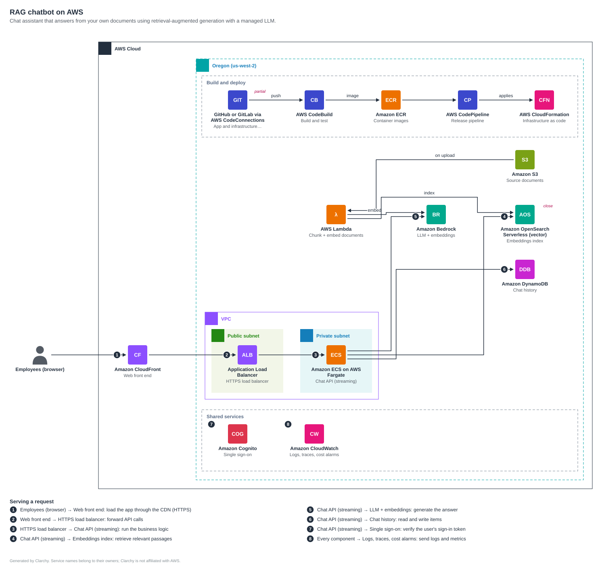

# CloudArchie

**An explainable cloud architecture advisor.** Describe what you want to build;
CloudArchie designs it, draws it with the provider's own icons, explains every service
choice, and (soon) prices it, including what you save with longer commitments. AWS first,
then GCP, Azure and open-source alternatives side by side.



## Why

Choosing services, estimating the bill and comparing clouds today means juggling a
diagram tool, a pricing calculator and three vendors' documentation, with little
explanation of *why* one service was chosen over another. Existing AI diagram tools
produce a picture and a single confident number. CloudArchie aims to be different in
four ways:

1. **Explains every choice:** a rationale per component, alternatives, and fidelity
   notes where services are not true equivalents.
2. **Cloud-neutral by design:** architectures are written in *capabilities*
   (`object-storage`, `relational-db`, ...) and mapped to each provider, so comparisons
   price the same design rather than three different ones.
3. **Numbers you can trust (phase 2):** every cost line traceable to a price, a usage
   assumption and a pricing date, with ranges and published accuracy against the
   official calculators.
4. **The LLM proposes, code calculates:** the model never invents prices or diagram
   layout.

See [docs/PLAN.md](docs/PLAN.md) for the full product plan and market research.

## Status

**Phase 1 (this release):** cloud-neutral spec, 5 starter patterns, AWS mapping,
deterministic SVG diagrams, Markdown explanations, CLI. No cost engine or LLM yet.

## Quick start

```bash
python -m venv .venv && . .venv/bin/activate
pip install -e ".[dev]"

cloudarchie patterns                                   # list starter patterns
cloudarchie render rag-chatbot -o rag.svg              # draw it on AWS
cloudarchie explain rag-chatbot -o rag.md              # why each service was chosen
cloudarchie validate my-spec.yaml                      # check your own design
```

Pre-rendered outputs for every pattern are in [examples/](examples/).

### Use the official AWS icons

CloudArchie does not redistribute provider icons. Download the
[AWS Architecture Icons](https://aws.amazon.com/architecture/icons/) asset package, read
its terms, unzip it, and point CloudArchie at the folder:

```bash
export CLOUDARCHIE_ICONS_AWS=~/Downloads/Asset-Package
cloudarchie icons --provider aws                       # shows which icons were found
cloudarchie render container-api -o api.svg            # now uses official icons
```

Without the package, diagrams use neutral lettered badges (as in the examples here).

## Write your own spec

```yaml
name: Photo sharing
summary: Upload photos, generate thumbnails, share albums.
requirements:
  users: 50000
  peak_rps: 40
  region: india-mumbai          # see src/cloudarchie/data/regions.yaml
components:
  - id: users
    capability: client
  - id: api
    capability: api-gateway
  - id: thumbs
    capability: serverless-function
    rationale: Thumbnails are short bursty jobs; pay only when photos arrive.
    sizing: { invocations_per_month: 2000000, avg_duration_ms: 400, memory_mb: 1024 }
  - id: photos
    capability: object-storage
    sizing: { storage_gb: 800 }
edges:
  - { from: users, to: api }
  - { from: api, to: thumbs }
  - { from: thumbs, to: photos }
```

Capabilities are listed in
[`src/cloudarchie/data/capabilities.yaml`](src/cloudarchie/data/capabilities.yaml);
AWS services for each are in
[`src/cloudarchie/data/mappings/aws.yaml`](src/cloudarchie/data/mappings/aws.yaml).

## How it works

```
idea ─► requirements ─► NEUTRAL SPEC ─► provider mapping ─► diagram + explanation
                         (capabilities,     (data/mappings/      (deterministic SVG,
                          sizing, edges,      <provider>.yaml)     Markdown)
                          rationale)
```

- `spec.py`: Pydantic models and validation of the neutral spec
- `mapping.py`: capability → provider service, with fidelity (exact / close / partial)
- `render.py`: deterministic layout by tier (users → edge → entry → compute →
  integration → data, shared services below), crossing reduction, optional official icons
- `explain.py`: Markdown explanation of choices, alternatives and sizing
- `data/`: capabilities, regions, mappings and patterns as reviewable YAML

Design decisions are recorded in [docs/decisions/](docs/decisions/).

## Development

```bash
make check       # ruff + pytest
make examples    # regenerate examples/ (they double as golden test files)
```

## Roadmap

| Phase | What |
|---|---|
| ✅ 1 | Neutral spec, patterns, AWS mapping, SVG renderer, CLI |
| 2 | AWS cost engine: Price List ingestion, usage model, hidden costs, low/expected/high ranges, accuracy check against the AWS Pricing Calculator |
| 3 | Savings Plans / Reserved Instances / Spot with break-even, Well-Architected advisor and add-ons, PDF report |
| 4 | LLM intake: idea → clarifying questions → spec, with teach mode |
| 5 | Web UI with provider tabs, deployed on AWS |
| 6-8 | GCP and Azure tabs, side-by-side comparison |
| 9 | Open-source alternatives with an operations-effort cost model |

## Known limitations

- Layout is strictly left-to-right by tier. In flows that go compute → queue → compute
  (see `examples/event-driven-processing.aws.svg`) some lines pass behind boxes. Better
  edge routing is planned.
- Links to shared services (identity, secrets, monitoring) are listed in the explanation
  rather than drawn, to keep diagrams readable.
- Icon filename stems in `aws.yaml` are best-effort; `cloudarchie icons` reports any that
  don't match your downloaded package.

## Licence

Not chosen yet; until a licence is added, all rights are reserved.

AWS, Amazon Web Services and all AWS service names are trademarks of Amazon.com, Inc. or
its affiliates. CloudArchie is an independent project, not affiliated with or endorsed by
any cloud provider.
